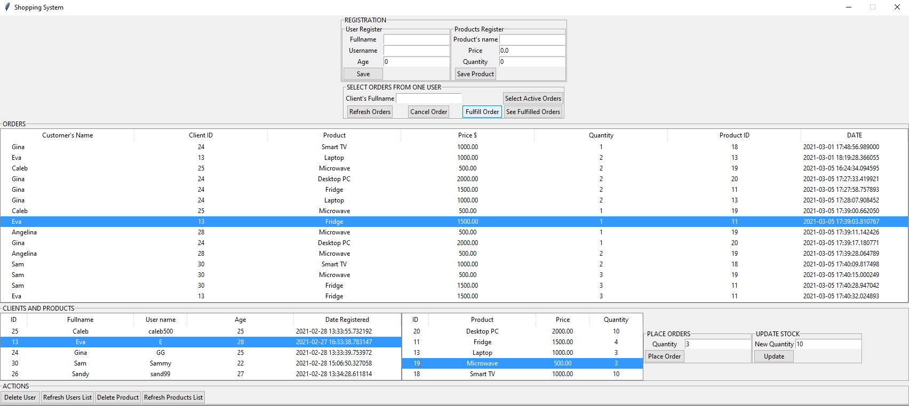
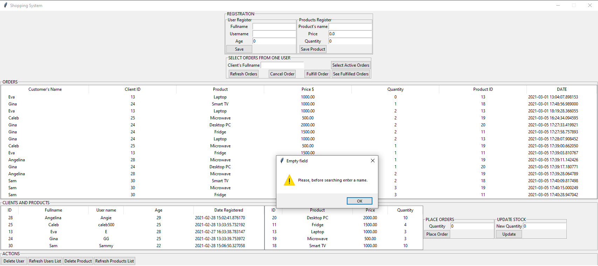
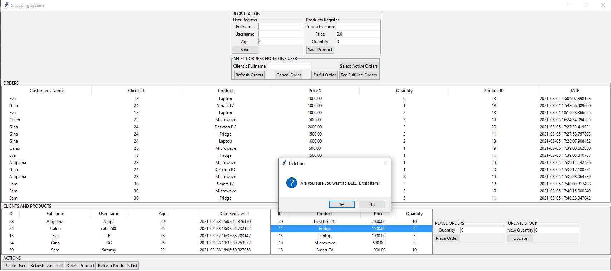

# Shopping System Using Python and PostgreSQL

## Description
This project is focused on helping people from small companies to keep track of their clients, 
as well as their products and also to take and fulfill orders placed.

This software could be managed by one or more people, who are responsible for the sells administration, these people
will register the new customers, incoming products and new orders. 
The GUI was designed with the python Tkinter library, and it should be pretty easy to use. 

In addition, the database for this project was created with postgreSQL. The making of the database and the related tables, 
as well as some useful queries can be found in the "queries.sql" file.

# Working
This project works by using tables or Treeviews from the GUI, so when a change has to be made, it is necessary to
select the row to be modified, and choose an option. Also, all the registration entries must be filled correctly
in order to save the new information.

# GUI Design

The GUI uses 3 main tables, where the manager of this app can find the clients, avaliable products and current orders. 
Plus, CRUD operations can be performed in order to modify the products and customers information.
The user interface looks like this:

If some fields or rows are not selected when necessary, the messages like this will be displayed.

To verify a _deletion_ action, choose an option from the message box.

